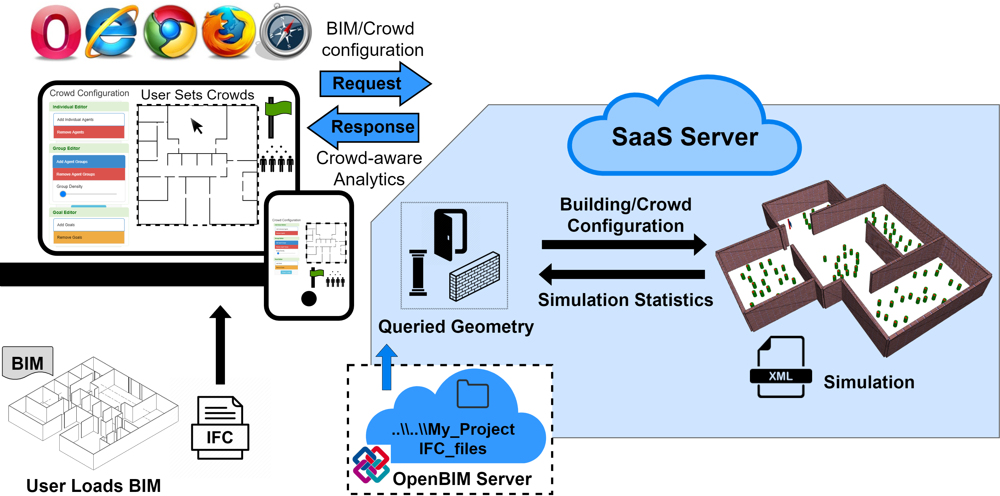
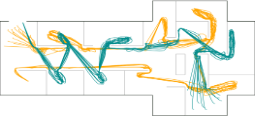
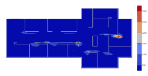

# Simulation-as-a-Service

* BIM (IFC) supported
* Egress evacuations
* Author domain-specific crowd scenarios
* Bottleneck and path analyses
* Crowd animation
* Informative visualizations

***

***
## Our Vision
A single, integrated platform for researchers and industry experts in Engineering, Architecture, and HCI to share building models, evaluate and analyze the dynamics of built-environments for human-building interactions, crowdsource collaborative human-aware building designs and share simulation-driven analytics for built-environments with other users. We posit that such a platform would foster communication among design stakeholders across different disciplines thus enabling the design of buildings that are cognizant of the behavior of the inhabitants in day-to-day as well as emergency conditions to ensure safety, productivity and satisfaction of the inhabitants. 
***

### Path Analysis
The path analysis module lets you explore simulation traces as an animation or at any timestep in the simulation.

***
### Bottleneck Analysis
An aggregate density based analysis showing where the majority of space was utilized.

***
